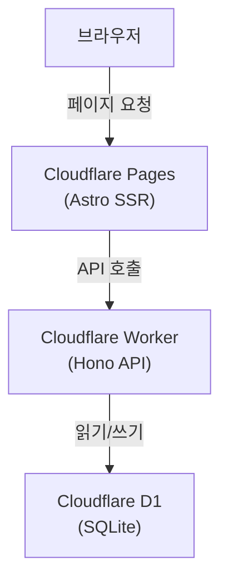
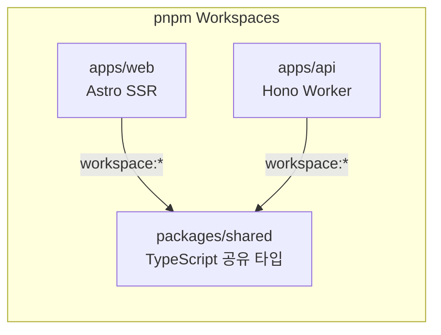

# {{project-name}}

프로젝트 설명을 여기에 작성하세요.

---

## 아키텍처





---

## 로컬 개발

각각 별도 터미널에서 실행.

| 파일 | 설명 |
|------|------|
| `dev-api.bat` | API 서버 → http://localhost:8787 (로컬 D1 자동 초기화) |
| `dev-web.bat` | 프론트엔드 → http://localhost:4321 (API localhost 자동 연결) |

---

## 최초 세팅

### 1. 플레이스홀더 교체
전체에서 `{{project-name}}`과 `{{cf-account}}`를 실제 값으로 변경.

### 2. D1 생성
```bash
cd apps/api
npx wrangler d1 create {{project-name}}-db
```
출력된 `database_id`를 `apps/api/wrangler.toml`에 입력.

### 3. GitHub Secrets 설정
| Secret | 설명 |
|--------|------|
| `CF_API_TOKEN` | Cloudflare API 토큰 (**D1 Edit 권한 필수**) |
| `CF_ACCOUNT_ID` | Cloudflare 계정 ID |

### 4. Cloudflare Secrets 설정 (선택)
Cloudflare Dashboard → `{{project-name}}-api` → Settings → Variables and Secrets

| Secret | 설명 |
|--------|------|
| `ADMIN_SECRET` | 관리자 API 인증 키 |
| `SLACK_WEBHOOK_URL` | 크롤링 실패 알림용 Slack Webhook |

---

## 서비스 URL

| 환경 | URL |
|------|-----|
| Frontend | https://{{project-name}}.pages.dev |
| API | https://{{project-name}}-api.{{cf-account}}.workers.dev |

---

## API 엔드포인트

| Method | Path | 설명 |
|--------|------|------|
| GET | `/api/health` | 헬스체크 |
